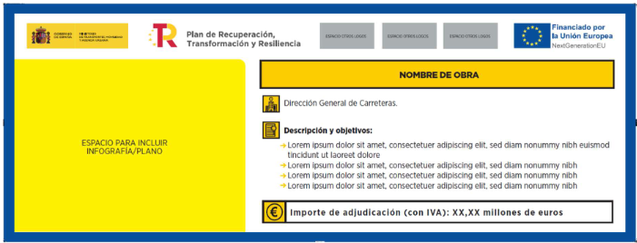
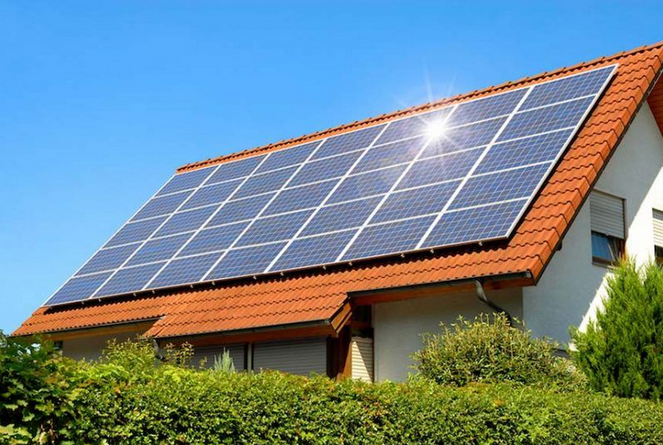
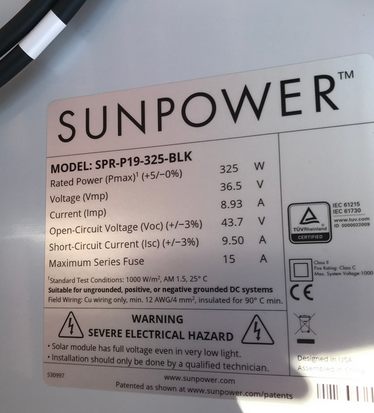
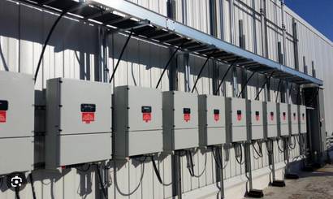
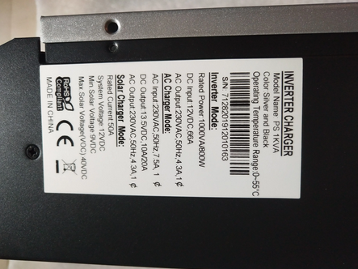
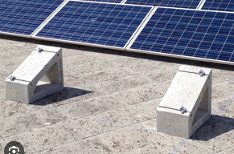
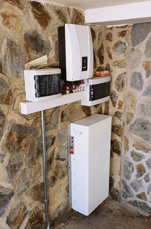
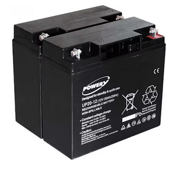
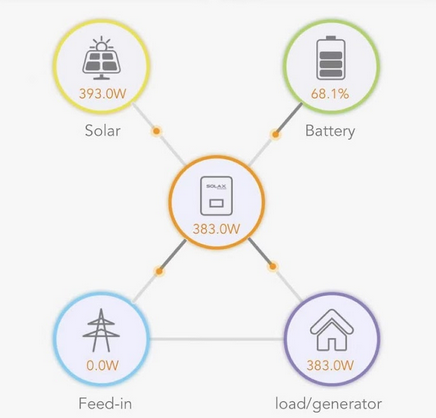

---
campos: ['Tecnico']
title: INFORME JUSTIFICATIVO de la previsión de que el consumo anual de energía por parte del consumidor o consumidores asociados a la instalación sea igual o mayor al 80 % de la energía anual generada por la instalación objeto de la ayuda.         
author: Quico Roman y Asociados
header-includes: |
    \usepackage{fancyhdr}
    \pagestyle{fancy}
    \fancyhead{}
    \fancyhead[R]{REPORTAJE FOTOGRÁFICO DE ACTUACIÓN EJECUTADA DE GENERACIÓN FOTOVOLTAICA}
    \fancyfoot{}
    \fancyfoot[R]{Página \thepage }
    \fancyfoot[L]{\includegraphics[width=1.5cm]{assets/_qr.png} }
abstract: El apartado 5 del Artículo 13 y el apartado F, del Anexo AI.1 del Real Decreto 477/2021 establecen que, para ser elegibles, los destinatarios últimos del programa de incentivos 4 tendrán que justificar la previsión de que, en cómputo anual, la suma de la energía eléctrica consumida por parte del consumidor o consumidores asociados a la instalación de autoconsumo objeto de ayuda sea igual o superior al 80 % de la energía anual generada por ésta, según lo establecido en el anexo II. De acuerdo a lo publicado en el RD 477/2021, para los destinatarios últimos acogidos al programa 4, es necesario la presentación de una declaración responsable en fase de solicitud y de un informe en fase de justificación1, ambos documentos firmados por técnico competente o empresa instaladora, en los que se estime y justifique respectivamente que el consumo de la instalación es igual o superior al 80% de la energía generada.
...
\listoffigures
\listoftables
\pagebreak

# INFORME JUSTIFICATIVO de la previsión de que el consumo anual de energía por parte del consumidor o consumidores asociados a la instalación sea igual o mayor al 80 % de la energía anual generada por la instalación objeto de la ayuda.          <a href="../111_Justificante_REPORTAJE FOTOGRÁFICO DE ACTUACIÓN EJECUTADA DE GENERACIÓN FOTOVOLTAICA.pdf">   :fontawesome-solid-file-pdf:</a>,<a href="../111_Justificante_REPORTAJE FOTOGRÁFICO DE ACTUACIÓN EJECUTADA DE GENERACIÓN FOTOVOLTAICA formulario">    :fontawesome-solid-file-pen:</a>

## Introducción.
En el presente documento se dejará constancia gráfica de las instalaciones ejecutadas, y que han sido
objeto de incentivo, para lo cual se incluirán fotografías relacionadas con los diferentes equipos y
elementos que forman parte de la instalación, así como de los equipos destinados al seguimiento-
monitorización y las correspondientes a las obligaciones de publicidad.

**N.º DE EXPEDIENTE: 3214123412342**

## Emplazamiento donde se ubica la instalación tras su ejecución y su publicidad.

Table: Emplazamiento donde se ubica la instalación tras su ejecución y su publicidad.

|  |  |
| ------------------------------------------------------------ | ------------------------------------------------------------ |
| Instalación: Espacio destinado a la fotografía del equipo (generador fotovoltaico – campo de paneles)asociado al emplazamiento de ubicación (vivienda –edificio). Se subirá fotografía que permita visualizar la instalación y el edificio de forma conjunta. | Cartel/placa publicitaria de los fondos: Espaciodestinado a la fotografía de la publicidad, placa ocartel publicitario (según actuación). Los modelosde referencias se encuentran en la página web de laAAE “Medidas de información y publicidad para actuaciones cofinanciadas por la Unión Europea –con fondos “NextgenerationEU”[^3][^4].Se subirá fotografía de la publicidad en lugar bien visible para el público. |

\pagebreak

## Elementos y equipos de la instalación 

### I.- Panel e inversor.

Table: Elementos y equipos de la instalación (I).

|  |  |
| ------------------------------------------------------------ | ------------------------------------------------------------ |
| Panel fotovoltaico: Espacio destinado al equipo de generación (campo solar). Para ello, se deberá subir fotografía que permita visualizar la totalidad o el máximo de la superficie de captación instalada. | Placa de características técnicas del panel fotovoltaico: Espacio destinado a la etiqueta dispuesta en la parte posterior del panel, que permita visualizar los datos técnicos declarados por elfabricante. Para ello, se deberá subir fotografía de la etiqueta del fabricante que tiene el equipo. |
|                |       |
| Inversor de conexión a la red interior del consumidor: Espacio destinado al equipo inversor. En aquellas instalaciones dotadas con más de un inversor, se deberá aportar fotografía que permita visualizar la totalidad de las unidades instaladas. | Placa de características técnicas del inversor: Espacio destinado a la etiqueta de características técnicas del equipo. Para ello, se deberá subir fotografía de la etiqueta del fabricante que tiene el equipo en su carcasa. |

\pagebreak

### II.- Estructura y batería.

Table: Elementos y equipos de la instalación (II)

|               |                |
| ------------------------------------------------------------ | ------------------------------------------------------------ |
| Estructura soporte: Espacio destinado a la estructura que soporta el campo solar, para aquellos casos en los que se haya declarado instalación con marquesina. Para ello, se subirá fotografía de la estructura soporte, que permita visualizar claramente que la misma desempeña las funciones de marquesina. | Sistema antivertido: Espacio destinado al equipo que permite no verter energía a la red, en los casos de que sea de aplicación*. Se adjuntará fotografía del equipo destinado al antivertido, y para aquellos casos en los que el propio inversor realice las funciones de sistema de antivertido, se subirá la fotografía del propio inversor. * No son de aplicación para:-  Instalaciones aisladas de red.-  Instalaciones conectadas a red sin excedentes.-  Instalaciones conectadas a red con excedentes acogidas a compensación.-  Instalaciones eólicas del sector residencial de potencia igual o inferior a 3,69 kW. ) |
|  |  |
| Sistema de almacenamiento: Espacio destinado al equipo acumulador de energía eléctrica (batería) en aquellas instalaciones que dispongan de almacenamiento. Para ello, se subirá fotografía del equipo de acumulación. | Placa característica del sistema de almacenamiento. Espacio destinado a la etiqueta de características técnicas del equipo. Para ello, se deberá subir fotografía de la etiqueta del fabricante, alojada en su carcasa. |

\pagebreak

## Sistema de monitorización de energía térmica e información.

Table: Sistema de monitorización de energía térmica e información.

|                |  |
| ------------------------------------------------------------ | ------------------------------------------------------------ |
| Sistema de monitorización: Espacio destinado al equipo de monitorización. Para ello, subirá la fotografía correspondiente al equipo de monitorización, y para aquellos casos en los que el inversor tenga la capacidad de monitorización, se aportará fotografía del propio inversor. | Visualización de la energía producida por la instalación y la consumida por el usuario: Espacio destinado a los datos de producción y consumos. Para ello, se subirá fotografía de la pantalla del equipo de monitorización donde se muestren los datos en tiempo real. |
|  |  |
| Pantalla de datos a tiempo real: En los casos que sea de aplicación*, espacio destinado a la pantalla informativa que muestre los parámetros de funcionamiento de la instalación. Se deberá subir fotografía de la pantalla informativa ubicada en un lugar de acceso público visible.*(no obligatorio en sector residencial) | Dispositivo móvil: Espacio destinado al equipo móvil (teléfono, Tablet, aplicación web...) cuando sea de aplicación*. Para ello, se subirá fotografía del equipo donde el usuario de forma remota visualiza el funcionamiento de la instalación, mostrando datos de funcionamiento en tiempo real. |

\pagebreak

\vspace{2cm}

Este documento fotográfico responde a la realidad de la instalación objeto de incentivo del expediente con nº de referencia 3214123412342 , lo que suscribe a los efectos de justificación de la ayuda.

\vspace{4cm}

 Quico Roman. 

Con DNI 24206918Q en calidad de:representante legal de la empresa instaladora.

\vspace{4cm}

Firma:

\pagebreak
.

\vspace{21cm}

{width=15% height=auto}

[https://wattbucket.com/Anexos/111_Justificante_REPORTAJE FOTOGRÁFICO DE ACTUACIÓN EJECUTADA DE GENERACIÓN FOTOVOLTAICA/](https://wattbucket.com/Anexos/111_Justificante_REPORTAJE FOTOGRÁFICO DE ACTUACIÓN EJECUTADA DE GENERACIÓN FOTOVOLTAICA/)

[^1]: [REPORTAJE FOTOGRÁFICO DE ACTUACIÓN EJECUTADA DE GENERACIÓN FOTOVOLTAICA CON/SIN ALMACENAMIENTO](https://incentivos.agenciaandaluzadelaenergia.es/documentacion/Autoconsumo2021/autoconsumo_reportaje_fotografico_gen.electr_fotovoltaica.pdf)
[^2]: [REPORTAJE FOTOGRÁFICO DE ACTUACIÓN EJECUTADA DE GENERACIÓN FOTOVOLTAICA CON/SIN ALMACENAMIENTO](https://incentivos.agenciaandaluzadelaenergia.es/documentacion/Autoconsumo2021/autoconsumo_reportaje_fotografico_gen.electr_fotovoltaica.pdf)

[^3]:[MANUAL DE COMUNICACIÓN PARA GESTORES Y BENEFICIARIOS DE LOS FONDOS DEL PLAN DE RECUPERACIÓN, TRANSFORMACIÓN Y RESILIENCIA](https://www.fondoseuropeos.hacienda.gob.es/sitios/dgpmrr/es-es/Documents/MANUAL%20DE%20COMUNICACI%C3%93N%20PARA%20LOS%20GESTORES%20DEL%20PLAN.pdf)

[^4]:[Obligaciones de comunicación, publicidad y difusión de los beneficiarios y gestores del Mecanismo de Recuperación y Resiliencia](https://www.mitma.gob.es/ministerio/proyectos-singulares/prtr/transporte/publicidad-y-difusion-de-las-ayudas-del-mecanismo-de-recuperacion-y-resiliencia)

