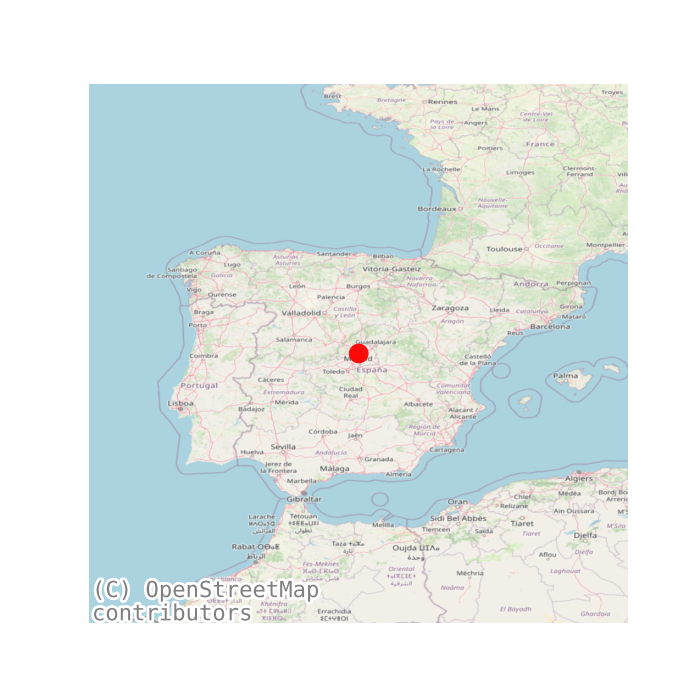

---
campos: ['Tecnico']
title: REPORTAJE FOTOGRÁFICO DE ACTUACIÓN EJECUTADA DE GENERACIÓN FOTOVOLTAICA CON/SIN ALMACENAMIENTO
author: Pepe Perez SL
header-includes: |
    \usepackage{fancyhdr}
    \pagestyle{fancy}
    \fancyhead[C]{}
    \fancyhead[R]{REPORTAJE FOTOGRÁFICO DE ACTUACIÓN EJECUTADA DE GENERACIÓN FOTOVOLTAICA}
    \fancyfoot[L]{Programa de incentivos 4 justificación del consumo anual de energía igual o superior al 80\% de la energía generada por la instalación}
abstract:  REPORTAJE FOTOGRÁFICO DE ACTUACIÓN EJECUTADA DE GENERACIÓN FOTOVOLTAICA CON/SIN ALMACENAMIENTO         
...
\listoffigures
\listoftables
\pagebreak

# REPORTAJE FOTOGRÁFICO DE ACTUACIÓN EJECUTADA DE GENERACIÓN FOTOVOLTAICA CON/SIN ALMACENAMIENTO <a href="../111_Justificante_REPORTAJE FOTOGRÁFICO DE ACTUACIÓN EJECUTADA DE GENERACIÓN FOTOVOLTAICA.pdf">   :fontawesome-solid-file-pdf:</a>,<a href="../111_Justificante_REPORTAJE FOTOGRÁFICO DE ACTUACIÓN EJECUTADA DE GENERACIÓN FOTOVOLTAICA formulario">    :fontawesome-solid-file-pen:</a>

## Intro
En el presente documento se dejará constancia gráfica de las instalaciones ejecutadas, y que han sido
objeto de incentivo, para lo cual se incluirán fotografías relacionadas con los diferentes equipos y
elementos que forman parte de la instalación, así como de los equipos destinados al seguimiento-
monitorización y las correspondientes a las obligaciones de publicidad.

N.º DE EXPEDIENTE:_________

## Emplazamiento

Table: Fig.1: Emplazamiento donde se ubica la instalación tras su ejecución y su publicidad.

|  |  |
| ------------------------------------------------------------ | ------------------------------------------------------------ |
| Instalación: Espacio destinado a la fotografía deequipo (generador fotovoltaico – campo de paneles)asociado al emplazamiento de ubicación (vivienda –edificio). Se subirá fotografía que permita visualizar lainstalación y el edificio de forma conjunta. | Cartel/placa publicitaria de los fondos: Espaciodestinado a la fotografía de la publicidad, placa ocartel publicitario (según actuación). Los modelosde referencias se encuentran en la página web de laAAE “Medidas de información y publicidad paraactuaciones cofinanciadas por la Unión Europea –confondos “NextgenerationEU”.Se subirá fotografía de la publicidad en lugar bienvisible para el público. |

## Elementos y equipos de la instalación

Table: Fig.2: Elementos y equipos de la instalación.

|  |  |
| ------------------------------------------------------------ | ------------------------------------------------------------ |
| Panel fotovoltaico: Espacio destinado al equipo degeneración (campo solar). Para ello, se deberá subirfotografía que permita visualizar la totalidad o elmáximo de la superficie de captación instalada. | Placa de características técnicas del panelfotovoltaico: Espacio destinado a la etiquetadispuesta en la parte posterior del panel, que permitavisualizar los datos técnicos declarados por elfabricante. Para ello, se deberá subir fotografía de laetiqueta del fabricante que tiene el equipo. |
|  |  |
| Inversor de conexión a la red interior del consumidor: Espacio destinado al equipo inversor. En aquellas instalaciones dotadas con más de un inversor, se deberá aportar fotografía que permita visualizar la totalidad de las unidades instaladas. | Placa de características técnicas del inversor: Espacio destinado a la etiqueta de características técnicas del equipo. Para ello, se deberá subir fotografía de la etiqueta del fabricante que tiene el equipo en su carcasa. |

Referencias [^1][^2]

[^1]: [REPORTAJE FOTOGRÁFICO DE ACTUACIÓN EJECUTADA DE GENERACIÓN FOTOVOLTAICA CON/SIN ALMACENAMIENTO](https://incentivos.agenciaandaluzadelaenergia.es/documentacion/Autoconsumo2021/autoconsumo_reportaje_fotografico_gen.electr_fotovoltaica.pdf)
[^2]: [REPORTAJE FOTOGRÁFICO DE ACTUACIÓN EJECUTADA DE GENERACIÓN FOTOVOLTAICA CON/SIN ALMACENAMIENTO](https://incentivos.agenciaandaluzadelaenergia.es/documentacion/Autoconsumo2021/autoconsumo_reportaje_fotografico_gen.electr_fotovoltaica.pdf)

