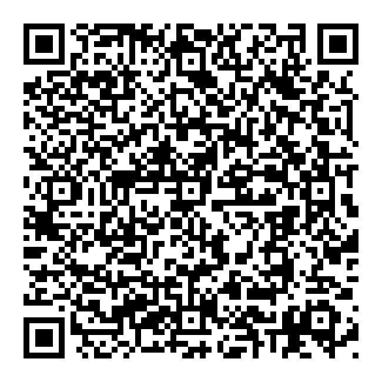

---
title: 
    Cálculo de las pérdidas de radiación solar por sombras
campos: ['Tecnico']
abstract: 
    Se utiliza el metodo del IDAE para la determinar la distancia mínima entre filas de módulos, tales que se garanticen al menos 4 horas de sol en torno al mediodía del solsticio de invierno.

author: Q.Roman
header-includes: |
    \usepackage{multicol}
    \usepackage{fancyhdr}
    \pagestyle{fancy}
    \fancyhead{}
    \fancyhead[R]{}
    \fancyfoot{}
    \fancyfoot[R]{Página \thepage}
...

<a href="../Cálculo de las pérdidas de radiación solar por sombras.pdf" style="font-size: 40px;">   :fontawesome-solid-file-pdf:</a>,
<a href="../Cálculo de las pérdidas de radiación solar por sombras.html" style="font-size: 40px;">    :fontawesome-solid-file-pen:</a>

## Cálculo de las pérdidas de radiación solar por sombras
### Objeto
El presente anexo describe un método de cálculo de las pérdidas de radiación solar que experimenta una superficie debidas a sombras circundantes. Tales pérdidas se expresan como porcentaje de la radiación solar global que incidiría sobre la mencionada superficie de no existir sombra alguna.

### Descripción del método
El procedimiento consiste en la comparación del perfil de obstáculos que afecta a la superficie de estudio con el diagrama de trayectorias del Sol. Los pasos a seguir son los siguientes:

####  Obtención del perfil de obstáculos
Localización de los principales obstáculos que afectan a la superficie, en términos de sus coordenadas de posición azimut (ángulo de desviación con respecto a la dirección Sur) y elevación (ángulo de inclinación con respecto al plano horizontal). Para ello puede utilizarse un teodolito.

#### Representación del perfil de obstáculos
Representación del perfil de obstáculos en el diagrama de la figura 5, en el que se muestra la banda de trayectorias del Sol a lo largo de todo el año, válido para localidades de la Península Ibérica y Baleares (para las Islas Canarias el diagrama debe desplazarse 12° en sentido vertical ascendente). Dicha banda se encuentra dividida en porciones, delimitadas por las horas solares (negativas antes del mediodía solar y positivas después de éste) e identificadas por u

## Caso Particular

<!--  -->
.

{width=15% height=auto}

[https://wattbucket.com/Anexos/Documentos/Estudios /Cálculo de las pérdidas de radiación solar por sombras/](https://wattbucket.com/Anexos/Documentos/Estudios /Cálculo de las pérdidas de radiación solar por sombras/)

<!-- referencias -->
<!-- IDAE 0*-->

[^O]: [DESCRIPCION](#)

[^01]:[IDAE. Oficina de Autoconsumo](https://www.idae.es/tecnologias/energias-renovables/oficina-de-autoconsumo)

[^02]:[IDAE. Pliego de Condiciones Técnicas de Instalaciones Conectadas a Red. 5 Distancia mínima entre filas de módulos](https://www.idae.es/uploads/documentos/documentos_5654_FV_pliego_condiciones_tecnicas_instalaciones_conectadas_a_red_C20_Julio_2011_3498eaaf.pdf)

[^03]:[IDAE. Pliego de Condiciones Técnicas de Instalaciones Aisladas de Red. 3.2 Orientación e inclinación óptimas. Pérdidas por orientación e inclinación](https://www.idae.es/uploads/documentos/documentos_5654_FV_Pliego_aisladas_de_red_09_d5e0a327.pdf)

[^04]:[Justificacion de la energía eléctrica consumida.](https://www.idae.es/sites/default/files/documentos/ayudas_y_financiacion/RD477-2021_Autoconsumo_y_almacenamiento/2022_02_08-Informe_80%25_Consumo_RD477.pdf)

[^05]:[Guía de orientaciones a los municipios para el fomento del autoconsumo](https://www.idae.es/sites/default/files/documentos/publicaciones_idae/2022-12-02_Guia_Autoconsumo_Ayuntamientos_v.3.pdf)

<!-- AAE 1* -->

[^3]: [plantilla DECLARACIÓN RESPONSABLE cumplimiento del principiode no causar daño significativo (DNSH). Instalaciones
con potencia inferior o igual a 100 kW nominales](https://incentivos.agenciaandaluzadelaenergia.es/documentacion/Autoconsumo2021/NO_AFECCION_%20A_OBJETIVOS_MEDIOAMBIENTALES.pdf)

[^4]: [https://incentivos.agenciaandaluzadelaenergia.es/Autoconsumo2021Web/faces/login.xhtml](https://incentivos.agenciaandaluzadelaenergia.es/Autoconsumo2021Web/faces/login.xhtml)
[^5]: [ JUSTIFICACIÓN DEL CUMPLIMENTO DE ACREDITACIÓN PARA ACTUACIONES DE SISTEMAS DE ALMACENAMIENTO RELATIVO AL CUMPLIMIENTO DE CONEXIÓN A LA
INSTALACIÓN DE AUTOCONSUMO](https://incentivos.agenciaandaluzadelaenergia.es/documentacion/Autoconsumo2021/autoconsumo_declaracion_sistema_almacenamiento.pdf)

[^6]:  [DECLARACIÓN RESPONSABLE relativa a la estimación de que el consumo anual deenergía por parte del consumidor o consumidoresasociados a la instalación sea igualo mayor al 80 % de la energía anual generada por la instalación](https://incentivos.agenciaandaluzadelaenergia.es/documentacion/Autoconsumo2021/autoconsumo_solicitud_declaracion_responsable_80.pdf)
[^10]:[Modelos orientativos, guías y ayudasDECLARACIÓN SOBRE EXISTENCIA O AUSENCIA DE CONFLICTO DE INTERESES (DCI / DACI)](https://incentivos.agenciaandaluzadelaenergia.es/documentacion/Autoconsumo2021/autoconsumo_conflicto_interes.pdf)

[^11]:

[^21]: [JUSTIFICACIÓN DEL CONSUMO ANUAL DE ENERGÍA IGUAL O SUPERIOR AL 80% DE LA ENERGÍA GENERADA POR LA INSTALACIÓN](https://www.idae.es/sites/default/files/documentos/ayudas_y_financiacion/RD477-2021_Autoconsumo_y_almacenamiento/2022_02_08-Informe_80%25_Consumo_RD477.pdf)
[^22]: En el caso de autoconsumos colectivos se presentará la suma de consumos de todos los suministros asociados al mismo, separados por CUPS.
[^23]: Para otros consumos no considerados en la tabla será igualmente razonable la consideración de ratios de fuentes como
[^24]: Considerando un consumo medio anual de electricidad por vivienda de 3.487 kWh y una potencia media contratada de 4 kW. Este valor de consumo anual se corresponde con el que aparece en el informe SPAHOUSEC I, publicado por IDAE:
https://www.idae.es/informacion-y-publicaciones/estudios-informes-y-estadisticas
[^25]:  Considerando un consumo medio de 16,3 kWh/km y 10.000 km al año.
[^26]: Considerando 12.000 kWh de demanda de calor al año y rendimiento medio estacional (SPF) de 3,0 para la bomba de calor.
[^27]: Considerando 2 horas de funcionamiento medio diario a una potencia media de 1 kW durante 90 días al año.
[^30]: Dirección (calle/municipio/CP/provincia ó polígono/parcela/municipio/provincia), y referencia catastral o coordenadas UTM.
[^31]: Incluido consumidores y CUPS correspondiente de cada uno de los consumidores asociados al autoconsumo en el cuadro  'Consumidores asociados'.
[^32]: De acuerdo con los cálculos justificativos del apartado 3.1.
[^33]: De acuerdo con los cálculos justificativos del apartado 3.2.](https://incentivos.agenciaandaluzadelaenergia.es/documentacion/Autoconsumo2021/autoconsumo_justificacion_documento_fotografico.pdf)
[^36]: Potencia de la instalación realmente ejecutada.
[^37]: Cociente (“valor consignado en c)” / “valor consignado en d)”) x 100
[^38]: Cociente (“valor consignado en d)” / “valor consignado en e)”) x 10

[^40]: [Declaración de cesión y tratamiento de datos en relación con la ejecución de actuaciones](https://incentivos.agenciaandaluzadelaenergia.es/documentacion/Autoconsumo2021/autoconsumo_cesion_datos_personafisica.pdf)

[^122]:[DECLARACIÓN DE COMPROMISOS ENRELACIÓN CON LA EJECUCIÓN DE
ACTUACIONES](https://incentivos.agenciaandaluzadelaenergia.es/documentacion/Autoconsumo2021/autoconsumo_compromiso_ejecucion.pdf)
[^123]: [Anexo X: Declaración de compromisos en relación con la ejecución de actuaciones](https://incentivos.agenciaandaluzadelaenergia.es/documentacion/Autoconsumo2021/autoconsumo_compromiso_personafisica.pdf)
[^124]: [DECLARACIÓN RESPONSABLE de la correcta gestión de los residuos generados por el proyecto incentivado](https://incentivos.agenciaandaluzadelaenergia.es/documentacion/Autoconsumo2021/autoconsumo_declaracion_responsable_residuos.pdf)
[^125]: [USTIFICACIÓN PRINCIPIO DE NO CAUSAR DAÑO SIGNIFICATIVO AL MEDIOAMBIENTE  (DNSH) PARA INSTALACIONES CON POTENCIA INFERIOR O IGUAL A 100KW](https://incentivos.agenciaandaluzadelaenergia.es/documentacion/Autoconsumo2021/autoconsumo_justificacion_declaracion_DNSH.pdf)

[^126]: [DOCUMENTO DE JUSTIFICACIÓN DEL PAGO A PRESENTAR](https://incentivos.agenciaandaluzadelaenergia.es/documentacion/Transversal/transversal_justificacion_mediospago.pdf)
[^127]: [GUÍA DE LICENCIAS Y AUTORIZACIONES ADMINISTRATIVAS](https://incentivos.agenciaandaluzadelaenergia.es/documentacion/Autoconsumo2021/autoconsumo_guia_licenciasypermisos.pdf)
[^128]: [MEMORIA JUSTIFICATIVA DE CUMPLIMIENTO DE LA CONDICIONESDE LAS BASES REGULADORAS PARA INSTALACIONES FOTOVOLTAICAS O EÓLICAS DE AUTOCONSUMO ELÉCTRICO CON O
SIN ALMACENAMIENTO (PROGRAMAS 1, 2 Y 4)](https://incentivos.agenciaandaluzadelaenergia.es/documentacion/Autoconsumo2021/autoconsumo_cumplimiento_requisitos.pdf)
[^129]:[REPORTAJE FOTOGRÁFICO DE ACTUACIÓN EJECUTADA DE GENERACIÓN FOTOVOLTAICA CON/SIN ALMACENAMIENTO](https://incentivos.agenciaandaluzadelaenergia.es/documentacion/Autoconsumo2021/autoconsumo_justificacion_documento_fotografico.pdf)

<!-- COMENTARIOS PARA EL CALCULO -->
[^551]: Si el objetivo de la medida está relacionado con la producción de electricidad o calor a partir de biomasa conforme conla Directiva (UE)2018/2001; y si el objetivo de la medida es lograr una reducción de las emisiones de gases de efectoinvernadero de al menos un 80 % en la instalación gracias al uso de biomasa en relación con la metodología de reducción
de gases de efecto invernadero y los combustibles fósiles de referencia establecidos en el anexo VI de la Directiva (UE)
2018/2001.
[^552]:Para la biomasa con grandes reducciones de GEI, se considerará que la instalación se corresponde con la etiqueta 030bis,si se acredita mediante la presentación del informe “Justificación de la reducción de emisiones de GEI de al menos un 80%en instalaciones de biomasa” que se detalla en el Real Decreto 477/2021, de 29 de junio.
