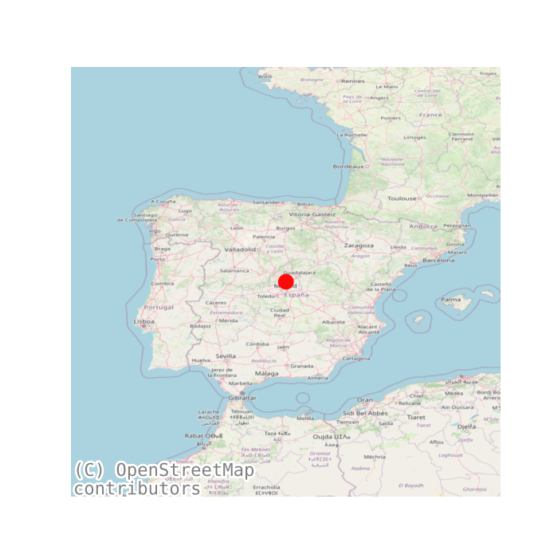
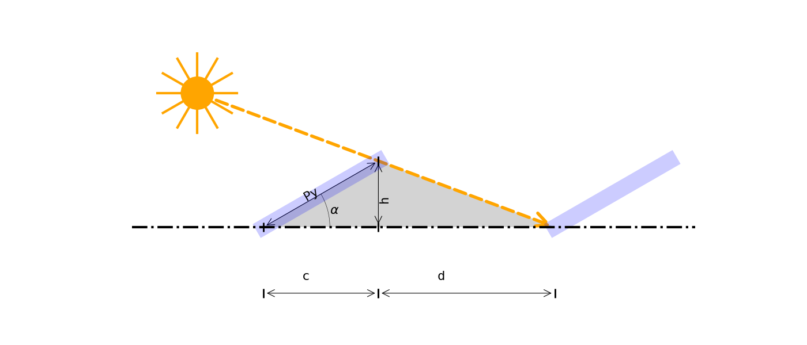
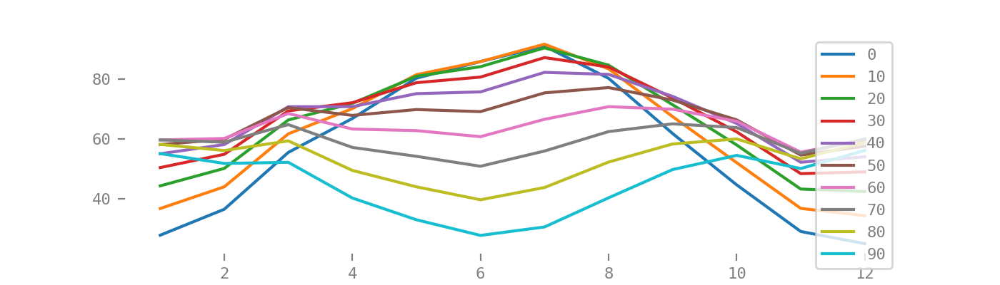
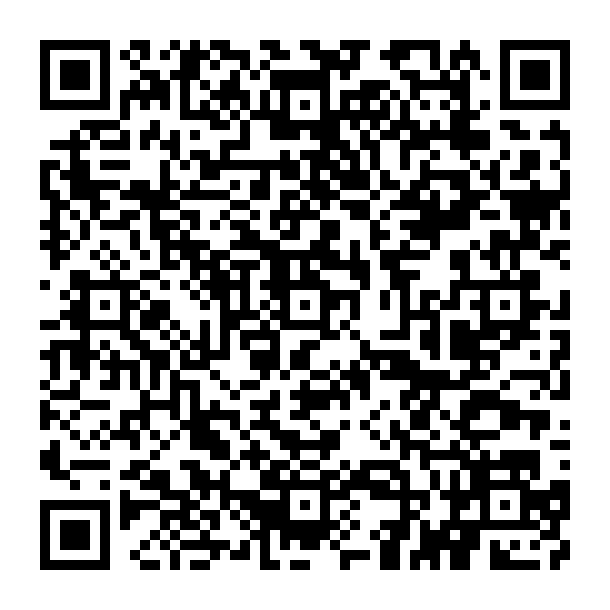

---
title: 
    Distancia mínima entre filas de módulos
campos: ['Tecnico']
abstract: 
    Se utiliza el metodo del IDAE para la determinar la distancia mínima entre filas de módulos, tales que se garanticen al menos 4 horas de sol en torno al mediodía del solsticio de invierno. Se obtiene la generacion por superficie de instalacion para distintas inclinaciones a una latitud dada.

author: Q.Roman
header-includes: |
    \usepackage{multicol}
    \usepackage{fancyhdr}
    \pagestyle{fancy}
    \fancyhead{}
    \fancyhead[R]{}
    \fancyfoot{}
    \fancyfoot[R]{Página \thepage}
...

<a href="../Distancia mínima entre filas de módulos.pdf" style="font-size: 40px;">   :fontawesome-solid-file-pdf:</a>,
<a href="../Distancia mínima entre filas de módulos.html" style="font-size: 40px;">    :fontawesome-solid-file-pen:</a>

## Distancia mínima entre filas de módulos[^02]

### Introduccion.

La distancia d, medida sobre la horizontal, entre filas de módulos o entre una fila y un obstáculo de altura h que pueda proyectar sombras, se recomienda que sea tal que se garanticen al menos 4 horas de sol en torno al mediodía del solsticio de invierno.

En cualquier caso, d ha de ser como mínimo igual a $h \cdot k$, siendo k un factor adimensional al que, en este caso, se le asigna el valor $1/tan(61^o - latitud)$.

En el Cuadro 1 pueden verse algunos valores significativos del factor k, en función de la latitud
del lugar.

Table: factor k en función de la latitud

| Latitud | 29°   | 37°   | 39°   | 41°   | 43°   | 45°   |
| ------- | ----- | ----- | ----- | ----- | ----- | ----- |
| k       | 1,600 | 2,246 | 2,475 | 2,747 | 3,078 | 3,487 |

Asimismo, la separación entre la parte posterior de una fila y el comienzo de la siguiente no será inferior a $h \cdot k$, siendo en este caso h la diferencia de alturas entre la parte alta de una fila y la parte baja de la posterior, efectuándose todas lasmedidas con relación al plano que contiene las bases de los módulos.

Si los módulos se instalan sobre cubiertas inclinadas, en el caso de que el azimut de estos, el de la cubierta, o el de ambos, difieran del valor cer o apreciablemente, el cálculo de la distancia entre filas deberá efectuarse mediante la ayuda de un programa de sombreado para casos generales suficientemente fiable, a fin de que se cumplan las condiciones requeridas.

### Caso Particular.

Para la Ubicacion en la latitud ($\phi$) de 40.42$^o$  y longitud -3.7$^o$

considerando las medidas de los modulos de 1m de largo y 2m de ancho y una disposicion horizontal. Se tiene:

En el Cuadro 2 se muestan los resultados para las distintas inclinaciones, $\beta$.

Table: Distancia mínima entre filas de módulos de 2m x 1m

|    |   $\alpha [^o]$ |   d[m] |   c[m] |   h[m] |   $E_{{anual}} [kWh]$ |   $A[m^2]$ |   $E/A[kWh/m^2]$ |
|---:|----------------:|-------:|-------:|-------:|----------------------:|-----------:|-----------------:|
|  0 |               0 |   0    |   1    |   0    |                685.54 |       2    |           342.77 |
|  1 |              10 |   0.46 |   0.98 |   0.17 |                746.46 |       2.88 |           259.19 |
|  2 |              20 |   0.91 |   0.94 |   0.34 |                788.66 |       3.7  |           213.15 |
|  3 |              30 |   1.33 |   0.87 |   0.5  |                811.6  |       4.4  |           184.45 |
|  4 |              40 |   1.71 |   0.77 |   0.64 |                815.71 |       4.96 |           164.46 |
|  5 |              50 |   2.04 |   0.64 |   0.77 |                800.09 |       5.36 |           149.27 |
|  6 |              60 |   2.31 |   0.5  |   0.87 |                764.25 |       5.62 |           135.99 |
|  7 |              70 |   2.5  |   0.34 |   0.94 |                708.88 |       5.68 |           124.8  |
|  8 |              80 |   2.62 |   0.17 |   0.98 |                634.35 |       5.58 |           113.68 |
|  9 |              90 |   2.66 |   0    |   1    |                542.75 |       5.32 |           102.02 |

donde:

- $\alpha [^o]$": Inclinacion.
- $Py [m]$:Ancho del modulo.
- $d [m]$: Longitud de la sombra en el solsticio de invierno.
- $c [m]$: Longitud de la sombra.
- $h [m]$: Altura del modulo inclinado.
- $E_{anual} [kWh]$: Energia anual generada por el modulo.
- $A[m^2]$ : Superficie ocupada.
- $E/A[kWh/m^2]$ : Energia por superficie ocupada.

## Generacion anual

En la Figura 3 se representa la generacion por meses para la latitud de 40.4$^o$

.

{width=15% height=auto}

[https://wattbucket.com/Anexos/Documentos/Estudios /Distancia mínima entre filas de módulos/](https://wattbucket.com/Anexos/Documentos/Estudios /Distancia mínima entre filas de módulos/)

<!-- referencias -->
<!-- IDAE 0*-->

[^O]: [DESCRIPCION](#)

[^01]:[IDAE. Oficina de Autoconsumo](https://www.idae.es/tecnologias/energias-renovables/oficina-de-autoconsumo)

[^02]:[IDAE. Pliego de Condiciones Técnicas de Instalaciones Conectadas a Red. 5 Distancia mínima entre filas de módulos](https://www.idae.es/uploads/documentos/documentos_5654_FV_pliego_condiciones_tecnicas_instalaciones_conectadas_a_red_C20_Julio_2011_3498eaaf.pdf)

[^03]:[IDAE. Pliego de Condiciones Técnicas de Instalaciones Aisladas de Red. 3.2 Orientación e inclinación óptimas. Pérdidas por orientación e inclinación](https://www.idae.es/uploads/documentos/documentos_5654_FV_Pliego_aisladas_de_red_09_d5e0a327.pdf)

[^04]:[Justificacion de la energía eléctrica consumida.](https://www.idae.es/sites/default/files/documentos/ayudas_y_financiacion/RD477-2021_Autoconsumo_y_almacenamiento/2022_02_08-Informe_80%25_Consumo_RD477.pdf)

[^05]:[Guía de orientaciones a los municipios para el fomento del autoconsumo](https://www.idae.es/sites/default/files/documentos/publicaciones_idae/2022-12-02_Guia_Autoconsumo_Ayuntamientos_v.3.pdf)

<!-- AAE 1* -->

[^3]: [plantilla DECLARACIÓN RESPONSABLE cumplimiento del principiode no causar daño significativo (DNSH). Instalaciones
con potencia inferior o igual a 100 kW nominales](https://incentivos.agenciaandaluzadelaenergia.es/documentacion/Autoconsumo2021/NO_AFECCION_%20A_OBJETIVOS_MEDIOAMBIENTALES.pdf)

[^4]: [https://incentivos.agenciaandaluzadelaenergia.es/Autoconsumo2021Web/faces/login.xhtml](https://incentivos.agenciaandaluzadelaenergia.es/Autoconsumo2021Web/faces/login.xhtml)
[^5]: [ JUSTIFICACIÓN DEL CUMPLIMENTO DE ACREDITACIÓN PARA ACTUACIONES DE SISTEMAS DE ALMACENAMIENTO RELATIVO AL CUMPLIMIENTO DE CONEXIÓN A LA
INSTALACIÓN DE AUTOCONSUMO](https://incentivos.agenciaandaluzadelaenergia.es/documentacion/Autoconsumo2021/autoconsumo_declaracion_sistema_almacenamiento.pdf)

[^6]:  [DECLARACIÓN RESPONSABLE relativa a la estimación de que el consumo anual deenergía por parte del consumidor o consumidoresasociados a la instalación sea igualo mayor al 80 % de la energía anual generada por la instalación](https://incentivos.agenciaandaluzadelaenergia.es/documentacion/Autoconsumo2021/autoconsumo_solicitud_declaracion_responsable_80.pdf)
[^10]:[Modelos orientativos, guías y ayudasDECLARACIÓN SOBRE EXISTENCIA O AUSENCIA DE CONFLICTO DE INTERESES (DCI / DACI)](https://incentivos.agenciaandaluzadelaenergia.es/documentacion/Autoconsumo2021/autoconsumo_conflicto_interes.pdf)

[^11]:

[^21]: [JUSTIFICACIÓN DEL CONSUMO ANUAL DE ENERGÍA IGUAL O SUPERIOR AL 80% DE LA ENERGÍA GENERADA POR LA INSTALACIÓN](https://www.idae.es/sites/default/files/documentos/ayudas_y_financiacion/RD477-2021_Autoconsumo_y_almacenamiento/2022_02_08-Informe_80%25_Consumo_RD477.pdf)
[^22]: En el caso de autoconsumos colectivos se presentará la suma de consumos de todos los suministros asociados al mismo, separados por CUPS.
[^23]: Para otros consumos no considerados en la tabla será igualmente razonable la consideración de ratios de fuentes como
[^24]: Considerando un consumo medio anual de electricidad por vivienda de 3.487 kWh y una potencia media contratada de 4 kW. Este valor de consumo anual se corresponde con el que aparece en el informe SPAHOUSEC I, publicado por IDAE:
https://www.idae.es/informacion-y-publicaciones/estudios-informes-y-estadisticas
[^25]:  Considerando un consumo medio de 16,3 kWh/km y 10.000 km al año.
[^26]: Considerando 12.000 kWh de demanda de calor al año y rendimiento medio estacional (SPF) de 3,0 para la bomba de calor.
[^27]: Considerando 2 horas de funcionamiento medio diario a una potencia media de 1 kW durante 90 días al año.
[^30]: Dirección (calle/municipio/CP/provincia ó polígono/parcela/municipio/provincia), y referencia catastral o coordenadas UTM.
[^31]: Incluido consumidores y CUPS correspondiente de cada uno de los consumidores asociados al autoconsumo en el cuadro  'Consumidores asociados'.
[^32]: De acuerdo con los cálculos justificativos del apartado 3.1.
[^33]: De acuerdo con los cálculos justificativos del apartado 3.2.](https://incentivos.agenciaandaluzadelaenergia.es/documentacion/Autoconsumo2021/autoconsumo_justificacion_documento_fotografico.pdf)
[^36]: Potencia de la instalación realmente ejecutada.
[^37]: Cociente (“valor consignado en c)” / “valor consignado en d)”) x 100
[^38]: Cociente (“valor consignado en d)” / “valor consignado en e)”) x 10

[^40]: [Declaración de cesión y tratamiento de datos en relación con la ejecución de actuaciones](https://incentivos.agenciaandaluzadelaenergia.es/documentacion/Autoconsumo2021/autoconsumo_cesion_datos_personafisica.pdf)

[^122]:[DECLARACIÓN DE COMPROMISOS ENRELACIÓN CON LA EJECUCIÓN DE
ACTUACIONES](https://incentivos.agenciaandaluzadelaenergia.es/documentacion/Autoconsumo2021/autoconsumo_compromiso_ejecucion.pdf)
[^123]: [Anexo X: Declaración de compromisos en relación con la ejecución de actuaciones](https://incentivos.agenciaandaluzadelaenergia.es/documentacion/Autoconsumo2021/autoconsumo_compromiso_personafisica.pdf)
[^124]: [DECLARACIÓN RESPONSABLE de la correcta gestión de los residuos generados por el proyecto incentivado](https://incentivos.agenciaandaluzadelaenergia.es/documentacion/Autoconsumo2021/autoconsumo_declaracion_responsable_residuos.pdf)
[^125]: [USTIFICACIÓN PRINCIPIO DE NO CAUSAR DAÑO SIGNIFICATIVO AL MEDIOAMBIENTE  (DNSH) PARA INSTALACIONES CON POTENCIA INFERIOR O IGUAL A 100KW](https://incentivos.agenciaandaluzadelaenergia.es/documentacion/Autoconsumo2021/autoconsumo_justificacion_declaracion_DNSH.pdf)

[^126]: [DOCUMENTO DE JUSTIFICACIÓN DEL PAGO A PRESENTAR](https://incentivos.agenciaandaluzadelaenergia.es/documentacion/Transversal/transversal_justificacion_mediospago.pdf)
[^127]: [GUÍA DE LICENCIAS Y AUTORIZACIONES ADMINISTRATIVAS](https://incentivos.agenciaandaluzadelaenergia.es/documentacion/Autoconsumo2021/autoconsumo_guia_licenciasypermisos.pdf)
[^128]: [MEMORIA JUSTIFICATIVA DE CUMPLIMIENTO DE LA CONDICIONESDE LAS BASES REGULADORAS PARA INSTALACIONES FOTOVOLTAICAS O EÓLICAS DE AUTOCONSUMO ELÉCTRICO CON O
SIN ALMACENAMIENTO (PROGRAMAS 1, 2 Y 4)](https://incentivos.agenciaandaluzadelaenergia.es/documentacion/Autoconsumo2021/autoconsumo_cumplimiento_requisitos.pdf)
[^129]:[REPORTAJE FOTOGRÁFICO DE ACTUACIÓN EJECUTADA DE GENERACIÓN FOTOVOLTAICA CON/SIN ALMACENAMIENTO](https://incentivos.agenciaandaluzadelaenergia.es/documentacion/Autoconsumo2021/autoconsumo_justificacion_documento_fotografico.pdf)

<!-- COMENTARIOS PARA EL CALCULO -->
[^551]: Si el objetivo de la medida está relacionado con la producción de electricidad o calor a partir de biomasa conforme conla Directiva (UE)2018/2001; y si el objetivo de la medida es lograr una reducción de las emisiones de gases de efectoinvernadero de al menos un 80 % en la instalación gracias al uso de biomasa en relación con la metodología de reducción
de gases de efecto invernadero y los combustibles fósiles de referencia establecidos en el anexo VI de la Directiva (UE)
2018/2001.
[^552]:Para la biomasa con grandes reducciones de GEI, se considerará que la instalación se corresponde con la etiqueta 030bis,si se acredita mediante la presentación del informe “Justificación de la reducción de emisiones de GEI de al menos un 80%en instalaciones de biomasa” que se detalla en el Real Decreto 477/2021, de 29 de junio.
