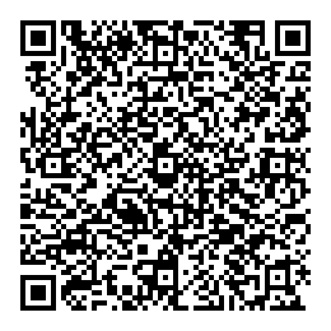

---
title: 
    Maximizacion de la produccion de energia anual
campos: ['Tecnico']
abstract: 
    Enlaces de interes
author: Q.Roman
header-includes: |
    \usepackage{multicol}
    \usepackage{fancyhdr}
    \pagestyle{fancy}
    \fancyhead{}
    \fancyhead[R]{1}
    \fancyfoot{}
    \fancyfoot[R]{Página \thepage}
...

<a href="../Maximizacion de la produccion de energia anual.pdf" style="font-size: 40px;">   :fontawesome-solid-file-pdf:</a>,
<a href="../Maximizacion de la produccion de energia anual.html" style="font-size: 40px;">    :fontawesome-solid-file-pen:</a>

## Disposicion de los modulos FV.

### Distancia mínima entre filas de módulos

Se utiliza el metodo del IDAE [^02] para la determinar la distancia mínima entre filas de módulos, tales que se garanticen al menos 4 horas de sol en torno al mediodía del solsticio de invierno.

$$
d_{min}=h \cdot 1/tan(61^o - \phi)
$$

donde:

- $d_{min}$: distancia mínima entre filas de módulos
- $h$: altura del obstáculo.
- $\phi$: latitud.
 

Para la Ubicacion en la latitud ($\phi$) de 40$^o$ representada en la figura

se representan las medidas a tener en cuenta para determinar la separacion entre filas en la figura.

En la tabla se muestan los distancias para las posibles inclinaciones, $\beta$,  con  modulos de 1m x 2m dispuestos horizontalmente.

Table: Distancia mínima entre filas de módulos

<!-- {pd.read_json(dddd.distanciaentrefilas).to_markdown()} -->

### Inclinación óptima. 

Se han calculado las medidas para inclinacion de la estructura comercial de $30^o$ mas cercana  a la inclinación óptimas  $\beta_{opt}$=30$^o$,  segun el metodo del IDAE [^03]  con el objetivo de  maximizar la producción anual.

## Sombras

## Generacion (PVGis)

## Estimacion del consumo

Se utiliza el metodo del IDAE [^03] para justificar la previsión, en cómputo anual, de la suma de la energía eléctrica consumida por parte del consumidor o consumidores asociados a la instalación de autoconsumo.

## Coste de la estructura. Estudio de cargas. (material y mano de obra).

Segun IDAE [^04],y basándonos en los criterios descritos en el CTE, no será necesario realizar estudios de carga, ya que los tejados y  cubiertas están obligados a soportar cargar mayores de las que implica una instalación de
autoconsumo,

se utilizarán contrapesos sobre la estructura soporte de
los módulos, para poder contrarrestar la acción del viento. Basándonos en el Código Técnico de la
Edificación para un viento de 130 km/h se establece como necesario un contrapeso a una
inclinación de 35º de 100 kg/m2.

### Coeficientes de presión externa en cubiertas con pendiente no superior a 5º
<!-- folleto de Sunfer -->
Según EUROCÓDIGO 1, en las zonas del extremo de la cubierta se
generan turbulencias y efectos adversos que amplifican el efecto del
viento.
<!-- recomentdaciones del idae a los ayuntamientos -->

<!-- contrapesos de primer curso de fotovoltaicas  y da las recomendaciones a los ayuntamientos -->

## Optimizacion

Luego, la función objetivo se ha modificado para incluir tanto la generación de energía como el costo del lastre. Los pesos generation_weight y cost_weight se utilizan para ajustar la importancia relativa de cada factor. Puedes ajustar estos pesos según tus necesidades y prioridades.

.

{width=15% height=auto}

[https://wattbucket.com/Estudios /Optimizacion/Maximizacion de la produccion de energia anual_relleno/](https://wattbucket.com/Estudios /Optimizacion/Maximizacion de la produccion de energia anual_relleno/)

<!-- referencias -->
<!-- IDAE 0*-->
[^O]: [DESCRIPCION](#)

[^01]:[IDAE. Oficina de Autoconsumo](https://www.idae.es/tecnologias/energias-renovables/oficina-de-autoconsumo)

[^02]:[IDAE. Pliego de Condiciones Técnicas de Instalaciones Conectadas a Red. 5 Distancia mínima entre filas de módulos](https://www.idae.es/uploads/documentos/documentos_5654_FV_pliego_condiciones_tecnicas_instalaciones_conectadas_a_red_C20_Julio_2011_3498eaaf.pdf)

[^03]:[IDAE. Pliego de Condiciones Técnicas de Instalaciones Aisladas de Red. 3.2 Orientación e inclinación óptimas. Pérdidas por orientación e inclinación](https://www.idae.es/uploads/documentos/documentos_5654_FV_Pliego_aisladas_de_red_09_d5e0a327.pdf)

[^04]:[Justificacion de la energía eléctrica consumida.](https://www.idae.es/sites/default/files/documentos/ayudas_y_financiacion/RD477-2021_Autoconsumo_y_almacenamiento/2022_02_08-Informe_80%25_Consumo_RD477.pdf)

[^05]:[Guía de orientaciones a los municipios para el fomento del autoconsumo](https://www.idae.es/sites/default/files/documentos/publicaciones_idae/2022-12-02_Guia_Autoconsumo_Ayuntamientos_v.3.pdf)

<!-- AAE 1* -->

[^3]: [plantilla DECLARACIÓN RESPONSABLE cumplimiento del principiode no causar daño significativo (DNSH). Instalaciones
con potencia inferior o igual a 100 kW nominales](https://incentivos.agenciaandaluzadelaenergia.es/documentacion/Autoconsumo2021/NO_AFECCION_%20A_OBJETIVOS_MEDIOAMBIENTALES.pdf)

[^4]: [https://incentivos.agenciaandaluzadelaenergia.es/Autoconsumo2021Web/faces/login.xhtml](https://incentivos.agenciaandaluzadelaenergia.es/Autoconsumo2021Web/faces/login.xhtml)
[^5]: [ JUSTIFICACIÓN DEL CUMPLIMENTO DE ACREDITACIÓN PARA ACTUACIONES DE SISTEMAS DE ALMACENAMIENTO RELATIVO AL CUMPLIMIENTO DE CONEXIÓN A LA
INSTALACIÓN DE AUTOCONSUMO](https://incentivos.agenciaandaluzadelaenergia.es/documentacion/Autoconsumo2021/autoconsumo_declaracion_sistema_almacenamiento.pdf)

[^6]:  [DECLARACIÓN RESPONSABLE relativa a la estimación de que el consumo anual deenergía por parte del consumidor o consumidoresasociados a la instalación sea igualo mayor al 80 % de la energía anual generada por la instalación](https://incentivos.agenciaandaluzadelaenergia.es/documentacion/Autoconsumo2021/autoconsumo_solicitud_declaracion_responsable_80.pdf)
[^10]:[Modelos orientativos, guías y ayudasDECLARACIÓN SOBRE EXISTENCIA O AUSENCIA DE CONFLICTO DE INTERESES (DCI / DACI)](https://incentivos.agenciaandaluzadelaenergia.es/documentacion/Autoconsumo2021/autoconsumo_conflicto_interes.pdf)

[^11]:

[^21]: [JUSTIFICACIÓN DEL CONSUMO ANUAL DE ENERGÍA IGUAL O SUPERIOR AL 80% DE LA ENERGÍA GENERADA POR LA INSTALACIÓN](https://www.idae.es/sites/default/files/documentos/ayudas_y_financiacion/RD477-2021_Autoconsumo_y_almacenamiento/2022_02_08-Informe_80%25_Consumo_RD477.pdf)
[^22]: En el caso de autoconsumos colectivos se presentará la suma de consumos de todos los suministros asociados al mismo, separados por CUPS.
[^23]: Para otros consumos no considerados en la tabla será igualmente razonable la consideración de ratios de fuentes como
[^24]: Considerando un consumo medio anual de electricidad por vivienda de 3.487 kWh y una potencia media contratada de 4 kW. Este valor de consumo anual se corresponde con el que aparece en el informe SPAHOUSEC I, publicado por IDAE:
https://www.idae.es/informacion-y-publicaciones/estudios-informes-y-estadisticas
[^25]:  Considerando un consumo medio de 16,3 kWh/km y 10.000 km al año.
[^26]: Considerando 12.000 kWh de demanda de calor al año y rendimiento medio estacional (SPF) de 3,0 para la bomba de calor.
[^27]: Considerando 2 horas de funcionamiento medio diario a una potencia media de 1 kW durante 90 días al año.
[^30]: Dirección (calle/municipio/CP/provincia ó polígono/parcela/municipio/provincia), y referencia catastral o coordenadas UTM.
[^31]: Incluido consumidores y CUPS correspondiente de cada uno de los consumidores asociados al autoconsumo en el cuadro  'Consumidores asociados'.
[^32]: De acuerdo con los cálculos justificativos del apartado 3.1.
[^33]: De acuerdo con los cálculos justificativos del apartado 3.2.](https://incentivos.agenciaandaluzadelaenergia.es/documentacion/Autoconsumo2021/autoconsumo_justificacion_documento_fotografico.pdf)
[^36]: Potencia de la instalación realmente ejecutada.
[^37]: Cociente (“valor consignado en c)” / “valor consignado en d)”) x 100
[^38]: Cociente (“valor consignado en d)” / “valor consignado en e)”) x 10

[^40]: [Declaración de cesión y tratamiento de datos en relación con la ejecución de actuaciones](https://incentivos.agenciaandaluzadelaenergia.es/documentacion/Autoconsumo2021/autoconsumo_cesion_datos_personafisica.pdf)

[^122]:[DECLARACIÓN DE COMPROMISOS ENRELACIÓN CON LA EJECUCIÓN DE
ACTUACIONES](https://incentivos.agenciaandaluzadelaenergia.es/documentacion/Autoconsumo2021/autoconsumo_compromiso_ejecucion.pdf)
[^123]: [Anexo X: Declaración de compromisos en relación con la ejecución de actuaciones](https://incentivos.agenciaandaluzadelaenergia.es/documentacion/Autoconsumo2021/autoconsumo_compromiso_personafisica.pdf)
[^124]: [DECLARACIÓN RESPONSABLE de la correcta gestión de los residuos generados por el proyecto incentivado](https://incentivos.agenciaandaluzadelaenergia.es/documentacion/Autoconsumo2021/autoconsumo_declaracion_responsable_residuos.pdf)
[^125]: [USTIFICACIÓN PRINCIPIO DE NO CAUSAR DAÑO SIGNIFICATIVO AL MEDIOAMBIENTE  (DNSH) PARA INSTALACIONES CON POTENCIA INFERIOR O IGUAL A 100KW](https://incentivos.agenciaandaluzadelaenergia.es/documentacion/Autoconsumo2021/autoconsumo_justificacion_declaracion_DNSH.pdf)

[^126]: [DOCUMENTO DE JUSTIFICACIÓN DEL PAGO A PRESENTAR](https://incentivos.agenciaandaluzadelaenergia.es/documentacion/Transversal/transversal_justificacion_mediospago.pdf)
[^127]: [GUÍA DE LICENCIAS Y AUTORIZACIONES ADMINISTRATIVAS](https://incentivos.agenciaandaluzadelaenergia.es/documentacion/Autoconsumo2021/autoconsumo_guia_licenciasypermisos.pdf)
[^128]: [MEMORIA JUSTIFICATIVA DE CUMPLIMIENTO DE LA CONDICIONESDE LAS BASES REGULADORAS PARA INSTALACIONES FOTOVOLTAICAS O EÓLICAS DE AUTOCONSUMO ELÉCTRICO CON O
SIN ALMACENAMIENTO (PROGRAMAS 1, 2 Y 4)](https://incentivos.agenciaandaluzadelaenergia.es/documentacion/Autoconsumo2021/autoconsumo_cumplimiento_requisitos.pdf)
[^129]:[REPORTAJE FOTOGRÁFICO DE ACTUACIÓN EJECUTADA DE GENERACIÓN FOTOVOLTAICA CON/SIN ALMACENAMIENTO](https://incentivos.agenciaandaluzadelaenergia.es/documentacion/Autoconsumo2021/autoconsumo_justificacion_documento_fotografico.pdf)

<!-- COMENTARIOS PARA EL CALCULO -->
[^551]: Si el objetivo de la medida está relacionado con la producción de electricidad o calor a partir de biomasa conforme conla Directiva (UE)2018/2001; y si el objetivo de la medida es lograr una reducción de las emisiones de gases de efectoinvernadero de al menos un 80 % en la instalación gracias al uso de biomasa en relación con la metodología de reducción
de gases de efecto invernadero y los combustibles fósiles de referencia establecidos en el anexo VI de la Directiva (UE)
2018/2001.
[^552]:Para la biomasa con grandes reducciones de GEI, se considerará que la instalación se corresponde con la etiqueta 030bis,si se acredita mediante la presentación del informe “Justificación de la reducción de emisiones de GEI de al menos un 80%en instalaciones de biomasa” que se detalla en el Real Decreto 477/2021, de 29 de junio.
