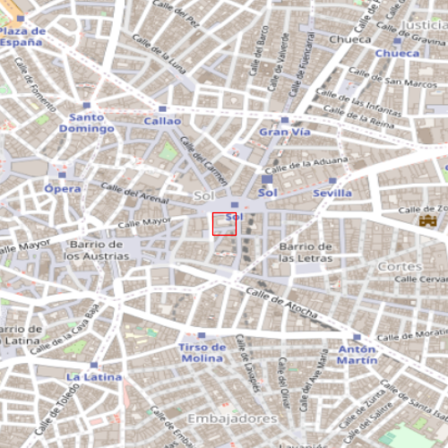
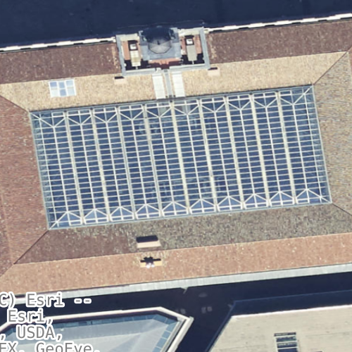

---
# https://pandoc.org/MANUAL.html
title: 
    Ubicacion
campos: ['Tecnico']
abstract: 
    Planos con la ubicacion de la instalacion.

author: Q.Roman
header-includes: |
    \usepackage{multicol}
    \usepackage{fancyhdr}
    \pagestyle{fancy}
    \fancyhead{}
    \fancyhead[R]{rfasdf}
    \fancyfoot[L]{dfasdf}
    \fancyfoot[R]{Página \thepage}

# Control
toc: True

geometry: "a3paper,left=2.5cm,right=1cm,top=1cm,bottom=1cm"

classoption: "landscape" 
# Bibliografía
bibliography: referencias.bib
csl: formato.csl
link-citations: true

---
<!--  -->
<!-- 

geometry: "a3paper,left=1cm,right=1cm,top=1cm,bottom=1cm"
classoption: "landscape" 

-->

afsadf

<a href="../Ubicacion.pdf" style="font-size: 40px;">   :fontawesome-solid-file-pdf:</a>,
<a href="../Ubicacion.html" style="font-size: 40px;">    :fontawesome-solid-file-pen:</a>

::: {#multicols .two}

## PZ PUERTA DEL SOL 7 MADRID

 
 
 
 

.

{width=15% height=auto}

[https://wattbucket.com/Anexos/Documentos/Planos/Ubicacion/](https://wattbucket.com/Anexos/Documentos/Planos/Ubicacion/)

