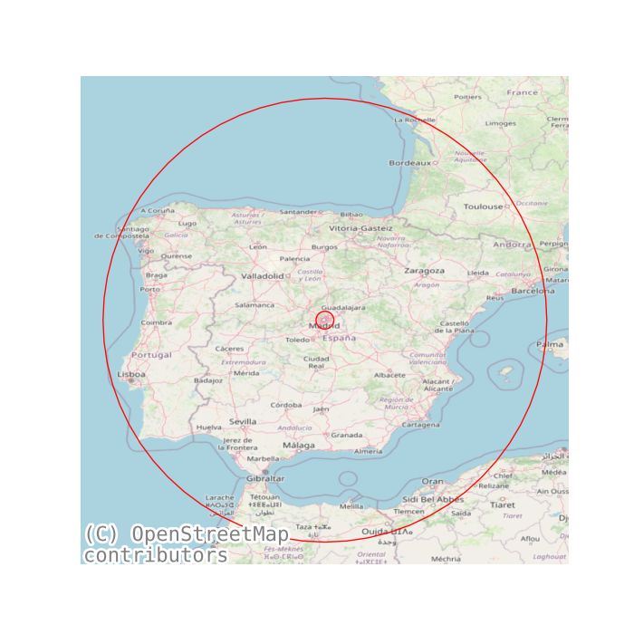
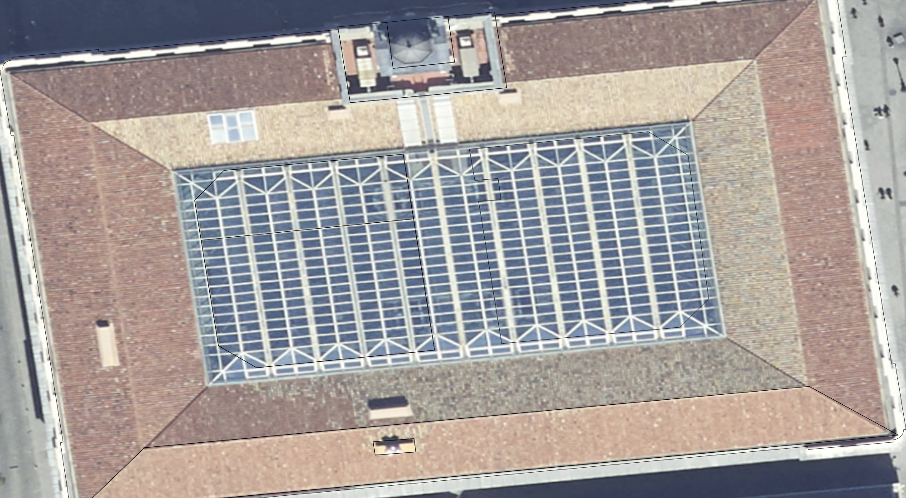
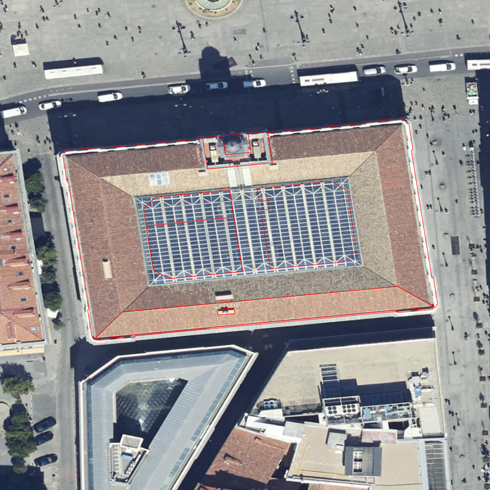

---
# https://pandoc.org/MANUAL.html
title: 
    Ubicacion
campos: ['Tecnico']
abstract: 
    Planos con la ubicacion de la instalacion.

author: Q.Roman
header-includes: |
    \usepackage{multicol}
    \usepackage{fancyhdr}
    \pagestyle{fancy}
    \fancyhead{}
    \fancyhead[R]{rfasdf}
    \fancyfoot[L]{dfasdf}
    \fancyfoot[C]{}
    \fancyfoot[R]{Página \thepage}
    \renewcommand{\footrulewidth}{0.4pt} 
# Control
toc: True

geometry: "a3paper,left=2.5cm,right=1cm,top=1.5cm,bottom=1.5cm"
classoption: "landscape" 
# geometry: "a4paper,left=2.5cm,right=1cm,top=1.5cm,bottom=1.5cm"

# Bibliografía
bibliography: referencias.bib
csl: formato.csl
link-citations: true

---

<a href="../Ubicacion.pdf" style="font-size: 40px;">   :fontawesome-solid-file-pdf:</a>,
<a href="../Ubicacion.html" style="font-size: 40px;">    :fontawesome-solid-file-pen:</a>

## Direccion
PZ PUERTA DEL SOL 7 MADRID / Coordenadas: (40.41630407781033, -3.703777670925774)

Table: Ubicacion

| {width=30% height=auto} | {width=30% height=auto} | {width=30% height=auto} |
| ------------------------------------------------------------ | ------------------------------------------------------------ | ------------------------------------------------------------ |
| {width=30% height=auto}                                                              | {width=30% height=auto} |                                                              |

<!-- { width=111% } -->

{ width=111% }

.

{width=15% height=auto}

[https://wattbucket.com/Anexos/Documentos/Planos/Ubicacion/](https://wattbucket.com/Anexos/Documentos/Planos/Ubicacion/)

