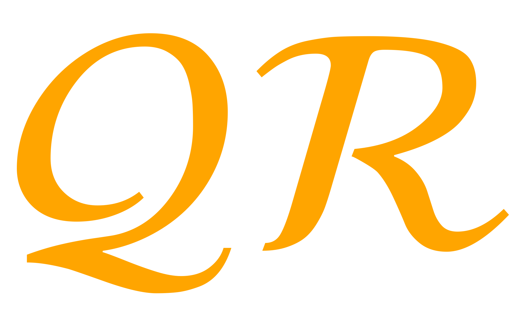
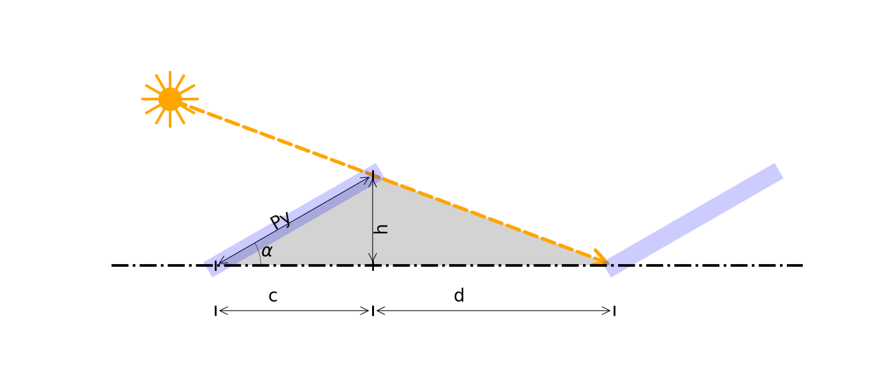
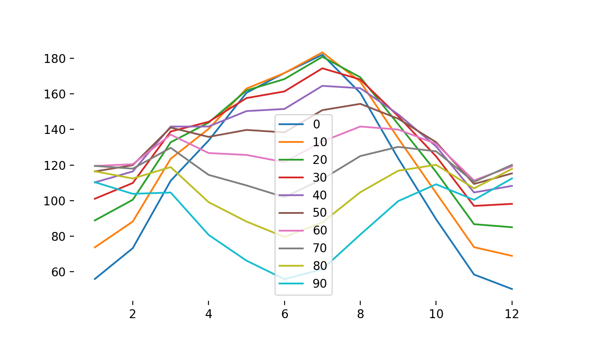

---
hide:
  - footer
  - navigation
  - toc
---

#
 
 
 

Hacia la transición energética

Queremos acompañarte en tu proyecto y poner a tu disposición nuestra experiencia en energías renovables y eficiencia energética para desarrollar proyectos sostenibles

    
    
    
    

 